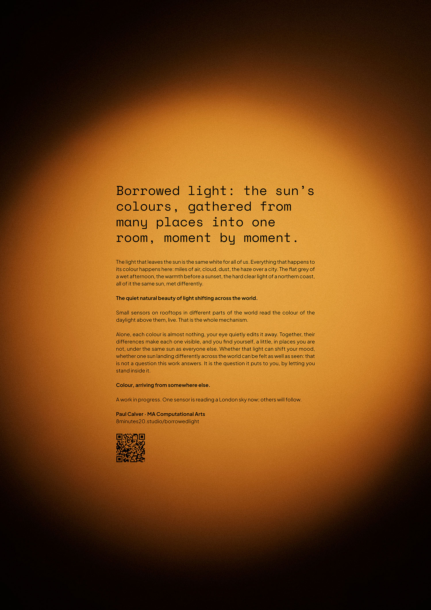
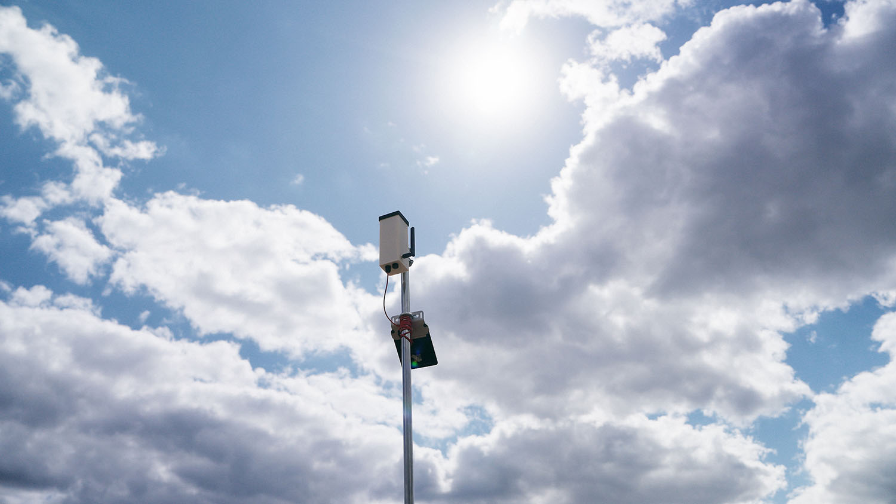
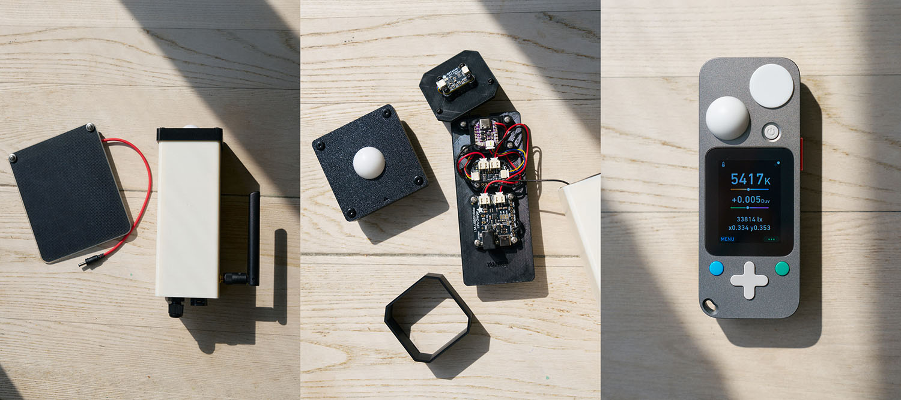

# Borrowed Light

*Global Colour: a live network reading the colour of daylight around the world.*

> ### ⚠️ The sensors are currently offline
>
> The domes fluoresce under sunlight. Optical brighteners in the material absorb
> ultraviolet and re-emit it as visible blue, pushing colour-temperature readings
> up to about 1,160K too high — an error invisible indoors and impossible to
> correct in software, because it tracks ambient UV rather than the light being
> measured.
>
> **I am looking for a new supplier for an OBA-free replacement diffuser.** If
> you make or sell one, or know the material well, please [get in
> touch](#contact). Detail in [Status](#status) below.

 

**Borrowed light: the sun's colours, gathered from many places into one room, moment by moment.**

The light that leaves the sun is the same white for all of us. Everything that happens to its colour happens here: miles of air, cloud, dust, the haze over a city. The flat grey of a wet afternoon, the warmth before a sunset, the hard clear light of a northern coast, all of it the same sun, met differently.

*The quiet natural beauty of light shifting across the world.*

Small sensors on rooftops in different parts of the world read the colour of the daylight above them, live. That is the whole mechanism.

*A prototype unit in place, dome to the sky.*

Alone, each colour is almost nothing, your eye quietly edits it away. Together, their differences make each one visible, and you find yourself, a little, in places you are not, under the same sun as everyone else. Whether that light can shift your mood, whether one sun landing differently across the world can be felt as well as seen: that is not a question this work answers. It is the question it puts to you, by letting you stand inside it.

*Colour, arriving from somewhere else.*

A work in progress, and openly so. One sensor has been reading a London sky; others will follow, elsewhere.

**[8minutes20.studio/borrowedlight](https://8minutes20.studio/borrowedlight)**

If you would like to hear more about the project's plans and ambitions, please do get in touch.

---

## In plain terms

Hold an identical piece of white paper under the sun in different places and it looks a subtly different colour, not because the paper changes, but because the light falling on it does. The eye compensates for this automatically and mostly hides it; the sensor does not, and records the daylight's actual colour instead. The long-term aim is a distributed network of these sensors, one per site (London first, then elsewhere), each feeding the same live dashboard, so that difference becomes something you can see and compare directly.

## Status

Three units exist. `sensor-00` is the bench reference: it stays indoors permanently and is never deployed, so every future unit can be checked against it rather than against a borrowed meter each time. `sensor-01` is the London unit. `sensor-02` will go somewhere else once there is a site for it.

All three are offline at the moment. Field readings through the summer of 2026 showed a colour-temperature error that tracked ambient UV rather than the light being measured: on the first outdoor comparison against a reference meter, all three units read between 900K and 1,160K too high, consistently, within seconds of each other. Duv barely moved, which is the signature of added blue light rather than a mis-aimed sensor or a bad fit.

The cause is optical brighteners fluorescing under sunlight — the material absorbs ultraviolet and re-emits it as visible blue, straight into the sensor. A 365nm test in August 2026 confirmed the source: the dome glows strongly, the printed mixing tube behind it only slightly. Studio calibration had been structurally blind to this, because the lamp used for it emits almost no UV. The error only ever appears in real sun.

This cannot be fitted out afterwards, for reasons covered under [Calibration: physical](#calibration-physical) below. The fix has to be a material change.

**So I am looking for a new dome supplier, and this is the open problem the project is on.** The replacement needs to diffuse light with a good cosine response, survive outdoors, and be free of optical brighteners. PTFE is the strongest candidate — it is what real radiometric instruments use as a cosine corrector, precisely because it is UV-stable and spectrally flat — but there appears to be no off-the-shelf curved PTFE dome at this scale, so the likely shape is a flat disc with a separate clear weather cover above it. Nothing is settled yet. Whatever the material, and whatever its marketing claims, every candidate gets tested under a 365nm lamp before it goes anywhere near a sensor: a UV-blocking rating is not a guarantee of being brightener-free.

If you make, sell, or know this kind of material, I would be glad to [hear from you](#contact).

## Technical notes

Adafruit QT Py ESP32-S2, OPT4048 tristimulus colour sensor, Voltaic P126 solar panel (6V, 2W), 2000 mAh LiPo battery, BQ24074 charge controller, MQTT over Wi-Fi, custom 3D-printed enclosure. On-device loop: read CIE x,y chromaticity and lux, publish over MQTT. Server: convert to kelvin, render true colour from the raw measurement. Each unit is designed and hand-built, running on solar power alone with no mains connection. The sensor measures the light itself, not the sky's appearance.

*Left: an assembled unit with its solar panel. Centre: the same unit opened out — dome and clamp ring, sensor deck, and the sled carrying the microcontroller, fuel gauge and charge controller. Right: the reference colour meter the units are calibrated against.*

The rest of this page is the long version of that summary.

---

## How it works

Sensor to `hex`: what each reading goes through, and how separate units are checked against each other and against a physical reference.

### Sensor

An `OPT4048` tristimulus colour sensor sits behind the dome and diffuser, reading four raw channels (`X`, `Y`, `Z`, and a clear `W` channel) once per publish cycle. Unlike an RGB camera sensor, these four channels are built to match the CIE 1931 colour-matching functions directly, so colour and level convert straight to standard colorimetric quantities, CIE `x, y` chromaticity and lux, without a lookup table in between.

### On the device

The microcontroller reads the sensor, takes its `x, y` chromaticity, and derives correlated colour temperature (CCT): the temperature of the blackbody radiator whose colour is the nearest match on the CIE diagram. `cct`, `lux`, `cie_x`, `cie_y`, the raw channel counts, a sensor-overload flag, and battery state are packaged as JSON and published over MQTT to a self-hosted broker.

### On the server

CCT alone collapses a two-dimensional colour to a single number along the blackbody curve, discarding the axis perpendicular to it: whether the light sits slightly green or slightly magenta of a true blackbody at that temperature. The server recovers that as **Duv**, computed from the stored `x, y` using the CIE 1960 UCS transform and a closed-form fit to the Planckian locus (Ohno, 2011), accurate to a few parts in 10⁻⁴ across the daylight range. Each reading is also stamped with the sensor's registered location and the sun's elevation and azimuth at that instant, so a colour can be read against time of day and season, not just in isolation.

### Colour you see

The colour on the grid and full-screen views is the sensor's measured chromaticity rendered as true colour, not a Kelvin-to-RGB approximation. `x, y` is converted to CIE XYZ at unit luminance, then to linear sRGB with the standard D65 primary matrix. Out-of-gamut negative values are clipped, and the result is normalised so the brightest channel reads full strength, brightness being deliberately discarded here, so the display is a pure colour comparison rather than an exposure match. sRGB gamma is applied and the three channels are rounded to 8 bits, giving the `hex` value.

### Calibration: computational

The correction is built, but no sensor has been fitted yet, so every CCT, `x, y`, and Duv value shown is still the sensor's raw reading. It is a small per-unit affine adjustment in mireds (10⁶/K, the scale colour-temperature error behaves linearly on) and Duv, fitted once against a trusted physical reference and then applied at ingest, the same stage Duv is already computed at. Raw values are never overwritten: the calibrated columns sit alongside them and stay empty until a fit exists, so a fit can be refined or redone as more reference data comes in without losing anything.

### Calibration: physical

That reference comes from a direct bench comparison. Two identically built units, same dome, diffuser, and sensor, are run side by side against a borrowed professional colour meter before either goes outdoors. Once the fit is established:

- one unit deploys to its site,
- the other stays permanently on the bench as a fixed source of truth, and
- every future unit gets checked against that bench reference, rather than against the meter each time.

The reference unit is never itself installed outdoors, so its own drift stays out of the loop.

This is also the limit the dome problem ran into. An affine fit can absorb a bias that is stable, or one that varies with colour temperature itself, because both are recoverable from the reading. It cannot absorb one driven by ambient UV, which varies independently of the colour being measured, and that is why the fix has to be a material change rather than a better fit.

---

## This repository

    firmware/     CircuitPython for the QT Py ESP32-S2. Reads the OPT4048,
                  derives CCT on-device, publishes over MQTT. Multi-SSID
                  fallback, NTP-aligned capture, optional OTA pull.
    mechanical/   CadQuery source for the IP65 enclosure, including the pole
                  and wall-mount brackets. Geometry is derived, not drawn:
                  change a component and the box follows.
    server/       Ingests MQTT, computes Duv and solar position, stores
                  readings, and serves the true-colour views.

Host addresses in `firmware/qt-py/settings.toml.example` are placeholders. Set `MQTT_BROKER`, `MQTT_USERNAME`, `MQTT_PASSWORD` and, if you want over-the-air updates, `OTA_BASE_URL` for your own deployment.

A full build guide — bill of materials, wiring, assembly, print settings — is still to come.

## Contact

**Paul Calver** — [paulcalver@me.com](mailto:paulcalver@me.com)

Project page: [8minutes20.studio/borrowedlight](https://8minutes20.studio/borrowedlight)

Do get in touch about a dome material or supplier, about putting a sensor on a
roof somewhere the network does not yet reach, or about the project generally.

## Licence

MIT, see [LICENSE](LICENSE). The CircuitPython libraries under `firmware/qt-py/lib/` are redistributed from the Adafruit bundle and keep their own MIT copyright.
